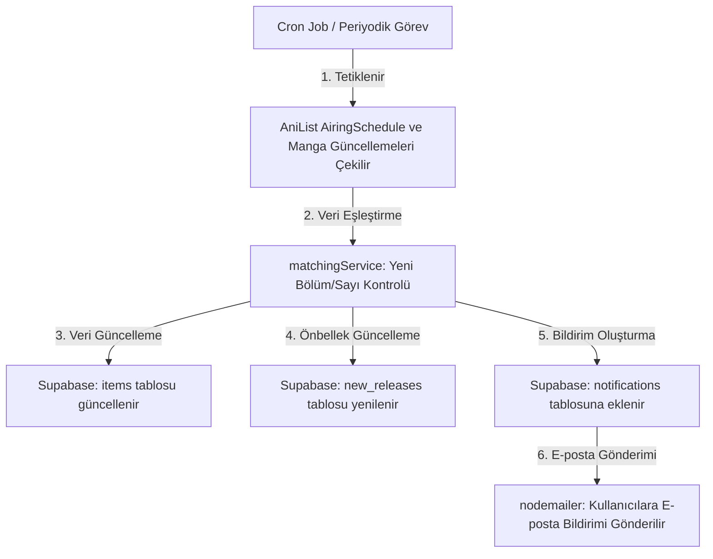

# 🎬 AnimeFinder - Anime ve Manga Takip Platformu

AnimeFinder, kullanıcıların en sevdikleri anime serilerini ve manga sayılarını takip etmelerine, yeni bölüm veya bölümler yayınlandığında web paneli ve e-posta yoluyla anlık bildirim almalarına olanak tanıyan modern, tam yığın (full-stack) bir web uygulamasıdır.

Uygulama, veri doğruluğu ve güncelliği için **AniList GraphQL API** ile entegre çalışır ve arka planda periyodik olarak çalışan bir güncelleme mekanizmasına (Cron Job) sahiptir.

---

## ✨ Özellikler

- **Tinder Tarzı Anime Keşfi (Anime Finder):** Kullanıcıların rastgele getirilen animeleri beğenip beğenmemesine göre çalışan ve beğendikleri türlere (genres) dayalı akıllı öneriler sunan interaktif keşif arayüzü.
- **Kişiselleştirilmiş Takip Listesi:** Favori anime ve mangaları listeye ekleme ve abonelikleri kolayca yönetebilme.
- **Otomatik Arka Plan Görevleri:** Her gün periyodik olarak çalışan arka plan görevleri sayesinde, takip edilen animelerin yeni bölümleri ve mangaların yeni sayıları AniList API üzerinden kontrol edilir.
- **Çok Kanallı Bildirim Sistemi:**
  - **Uygulama İçi Bildirimler:** Web arayüzündeki bildirim zili aracılığıyla anlık takip.
  - **E-posta Bildirimleri:** `Nodemailer` ile SMTP üzerinden gönderilen günlük güncellemeler ve yeni bölüm duyuruları.
- **Modern ve Şık Kullanıcı Deneyimi:** Duyarlı (responsive) kart tasarımları, sayfalama (pagination) ve detay sayfaları.
- **Güvenli Kimlik Doğrulama:** JWT (JSON Web Token) ve bcryptjs şifreleme algoritması ile desteklenen kayıt ve giriş sistemi.

---

## 🛠️ Teknolojiler ve Entegrasyonlar

### Frontend (İstemci)
- **Framework:** React 18, Vite
- **Yönlendirme (Routing):** React Router DOM (v6)
- **İkonlar:** Lucide React
- **Stil:** Custom Vanilla CSS (Modern, karanlık mod temalı cam efekti / glassmorphism tasarımı)

### Backend (Sunucu)
- **Çalışma Ortamı:** Node.js, Express
- **API İstekleri:** Axios
- **Arka Plan Görevleri:** Node-Cron
- **E-posta İletimi:** Nodemailer (SMTP)
- **Güvenlik & Kimlik Doğrulama:** JWT, bcryptjs

### Veritabanı (Database)
- **Platform:** Supabase (PostgreSQL)
- **Veri Erişimi:** `@supabase/supabase-js` istemcisi

### Dış Servisler
- **AniList API (GraphQL):** Anime yayın akışları ve manga güncel sayı takipleri için temel veri kaynağı.

---

## 📂 Proje Yapısı

```text
AnimeFinder/
├── client/                 # Frontend Kodları
│   ├── src/
│   │   ├── auth/          # Kimlik Doğrulama Bağlamı (AuthContext)
│   │   ├── components/    # Ortak Bileşenler (SearchBar, NotificationBell, vb.)
│   │   ├── pages/         # Sayfa Bileşenleri (Main, Sub, AnimeFinder, Details, vb.)
│   │   ├── App.jsx        # Ana Yönlendirme ve Layout Tanımı
│   │   ├── main.jsx       # Uygulama Giriş Noktası
│   │   └── styles.css     # CSS Tasarım Sistemi
│   ├── package.json
│   └── vite.config.mts
│
├── server/                 # Backend Kodları
│   ├── src/
│   │   ├── config/        # Veritabanı ve Supabase Ayarları
│   │   ├── controllers/   # İstek Kontrolcüleri (Abonelik, Bildirimler vb.)
│   │   ├── middleware/    # Auth Kontrol Ara Yazılımı
│   │   ├── routes/        # Express Rotaları (main, auth, sub, notification, vb.)
│   │   ├── services/      # Dış Servis Entegrasyonları (AniList, Cron, Email, Matching)
│   │   └── index.js       # Sunucu Başlangıç Dosyası
│   ├── .env               # Çevre Değişkenleri (Gizli)
│   ├── *.sql              # Supabase SQL Tablo Şemaları
│   └── package.json
```

---

## ⚙️ Kurulum ve Yapılandırma

### Gereksinimler
- Bilgisayarınızda **Node.js** (v18+ önerilir) kurulu olmalıdır.
- Veritabanı için bir **Supabase** hesabı ve projesi gereklidir.
- E-posta bildirimlerini göndermek için bir **SMTP hesabı** (örneğin Gmail App Password) gereklidir.

---

### 1. Veritabanı Şemalarının Kurulumu (Supabase)
Supabase SQL Editor panelini açın ve `server/` klasöründeki aşağıdaki SQL dosyalarını sırasıyla çalıştırın:
1. `public.users` tablosunu ve ilişkili alanları oluşturun.
2. [notification_table.sql](file:///c:/Users/cinar/Documents/GitHub/AnimeFinder/server/notification_table.sql) dosyasını çalıştırarak `notifications` tablosunu oluşturun.
3. [create_new_releases_table.sql](file:///c:/Users/cinar/Documents/GitHub/AnimeFinder/server/create_new_releases_table.sql) dosyasını çalıştırarak `new_releases` tablosunu oluşturun.
4. [update_items_schema.sql](file:///c:/Users/cinar/Documents/GitHub/AnimeFinder/server/update_items_schema.sql) dosyasını çalıştırarak `items` tablosunu güncelleyin.
5. İlişkileri düzeltmek için [fix_fk.sql](file:///c:/Users/cinar/Documents/GitHub/AnimeFinder/server/fix_fk.sql) ve [fix_notification_fk.sql](file:///c:/Users/cinar/Documents/GitHub/AnimeFinder/server/fix_notification_fk.sql) dosyalarını çalıştırın.

---

### 2. Backend (Server) Kurulumu

1. Server dizinine geçin ve bağımlılıkları yükleyin:
   ```bash
   cd server
   npm install
   ```

2. `.env` dosyası oluşturun ve aşağıdaki değişkenleri tanımlayın:
   ```env
   PORT=4000
   SUPABASE_URL=https://<your-supabase-id>.supabase.co
   SUPABASE_SERVICE_ROLE_KEY=<your-supabase-service-role-key>
   JWT_SECRET=<rastgele-uzun-bir-string>
   SMTP_HOST=smtp.gmail.com
   SMTP_PORT=587
   SMTP_USER=<gonderen-eposta-adresi>
   SMTP_PASS=<eposta-uygulama-sifresi>
   ```

3. Geliştirici modunda sunucuyu başlatın:
   ```bash
   npm run dev
   ```
   Sunucu varsayılan olarak `http://localhost:4000` portunda çalışacaktır.

---

### 3. Frontend (Client) Kurulumu

1. Client dizinine geçin ve bağımlılıkları yükleyin:
   ```bash
   cd client
   npm install
   ```

2. API bağlantısı otomatik olarak yönetilir. Geliştirme aşamasında yerel sunucuya (`http://localhost:4000/api`), yayında ise Render veya diğer dağıtım URL'sine bağlanır. (Detaylar için [AuthContext.jsx](file:///c:/Users/cinar/Documents/GitHub/AnimeFinder/client/src/auth/AuthContext.jsx) dosyasını inceleyebilirsiniz).

3. Geliştirici modunda istemciyi başlatın:
   ```bash
   npm run dev
   ```
   Uygulama tarayıcınızda `http://localhost:5173` adresinde açılacaktır.

---

## 🤖 Otomatik Güncelleme ve Bildirim Akışı

Sistem, [cronService.js](file:///c:/Users/cinar/Documents/GitHub/AnimeFinder/server/src/services/cronService.js) içerisindeki `node-cron` zamanlayıcısını kullanır.



### İşlem Adımları:
1. **Veri Çekme:** AniList API üzerinden günün anime yayın akışı ve abonelik listesindeki mangaların son durumu çekilir.
2. **Kıyaslama:** Çekilen veriler veritabanındaki mevcut kayıtlarla kıyaslanır. Yeni bir bölüm veya sayı tespit edilirse veritabanı güncellenir.
3. **Önbellek (Cache):** Yeni çıkan tüm içerikler `new_releases` tablosuna yazılır. Kullanıcılar ana sayfada hızlıca "Günün Yeni Çıkanları" kutusundan bu verilere erişebilir.
4. **Bildirim:** Kullanıcıların abonelikleriyle eşleşen yeni güncellemeler tespit edildiğinde, `notifications` tablosuna kayıt atılır ve kullanıcıya detaylı bir HTML e-postası gönderilir.

---

## 📄 Lisans

Bu proje kişisel gelişim ve eğitim amacıyla tasarlanmıştır. Dilediğiniz gibi geliştirebilir, çatallayabilir (fork) ve kendi projelerinizde kullanabilirsiniz.
